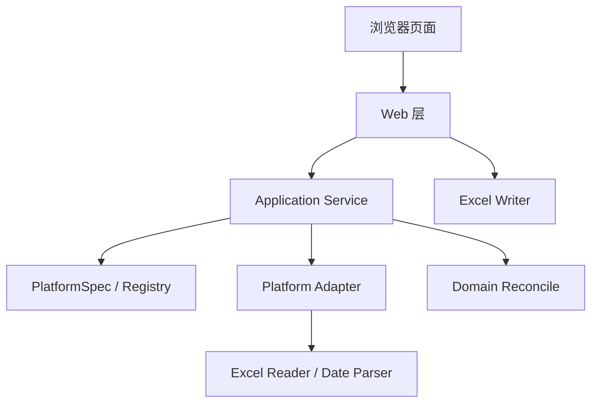

# 项目设计文档

文档版本：`v1.2`
整理日期：`2026-04-15`
文档用途：描述当前本地网页对账工具的实际系统设计，而不是仅描述第一阶段规划。

## 1. 项目目标

本项目面向财务人员，目标是：

- 在本地网页中完成对账
- 上传聚天下文件与外部平台文件
- 按月份过滤和业务口径计算
- 展示主结果表
- 展示双向差异检查
- 导出 Excel

项目当前不追求：

- 用户系统
- 历史持久化
- 数据库
- 自动调度
- 桌面打包

## 2. 当前支持范围

当前系统已经支持：

- `聚天下 + 携程`
- `聚天下 + 美团`
- `聚天下 + 抖音`

这说明系统已经进入“多平台、动态列、差异表头可变、输入结构可变”的阶段，不再是只面向单一平台的早期版本。

## 3. 当前总体架构

系统采用“分层 + 平台元数据 + 平台适配器 + 平台报表定义”的结构。



## 4. 分层职责

### 4.1 Web 层

代码位置：

- [app/web/routes.py](D:/DaMoXing/ZZY/finance/app/web/routes.py)
- [app/web/templates/index.html](D:/DaMoXing/ZZY/finance/app/web/templates/index.html)

职责：

- 接收上传文件
- 渲染结果页
- 组织导出 payload
- 触发 Excel 导出

不负责：

- 平台字段映射
- 领域汇总
- 平台专属计算

### 4.2 应用服务层

代码位置：

- [app/application/reconciliation_service.py](D:/DaMoXing/ZZY/finance/app/application/reconciliation_service.py)

职责：

- 读取聚天下内部订单
- 读取平台注册信息
- 加载平台工作簿
- 调用平台适配器
- 调用领域层
- 组合最终结果

### 4.3 平台元数据层

代码位置：

- [app/platforms/base.py](D:/DaMoXing/ZZY/finance/app/platforms/base.py)
- [app/platforms/registry.py](D:/DaMoXing/ZZY/finance/app/platforms/registry.py)

职责：

- 声明平台中文名
- 声明工作表列表
- 声明聚天下匹配字段
- 声明差异表头
- 声明适配器绑定关系

### 4.4 平台适配层

代码位置：

- [app/platforms/ctrip_adapter.py](D:/DaMoXing/ZZY/finance/app/platforms/ctrip_adapter.py)
- [app/platforms/meituan_adapter.py](D:/DaMoXing/ZZY/finance/app/platforms/meituan_adapter.py)
- [app/platforms/douyin_adapter.py](D:/DaMoXing/ZZY/finance/app/platforms/douyin_adapter.py)

职责：

- 平台字段校验
- 日期解析
- 金额清洗
- 按月过滤
- 一单多行聚合
- 输出统一订单级结构

### 4.5 领域层

代码位置：

- [app/domain/reconcile.py](D:/DaMoXing/ZZY/finance/app/domain/reconcile.py)

职责：

- 订单匹配
- 按产品汇总
- 汇总外部指标
- 计算利润
- 生成双向差异结果

### 4.6 基础设施层

代码位置：

- [app/infrastructure/excel_reader.py](D:/DaMoXing/ZZY/finance/app/infrastructure/excel_reader.py)
- [app/infrastructure/excel_writer.py](D:/DaMoXing/ZZY/finance/app/infrastructure/excel_writer.py)
- [app/infrastructure/date_parser.py](D:/DaMoXing/ZZY/finance/app/infrastructure/date_parser.py)

职责：

- Excel 读写
- 日期范围计算
- 导出工作簿组装

## 5. 当前统一数据契约

代码位置：

- [app/models/reconciliation.py](D:/DaMoXing/ZZY/finance/app/models/reconciliation.py)

### 5.1 内部订单

```python
InternalOrder(
    order_no: str,
    product_name: str,
    actual_people: float,
    purchase_amount: float,
)
```

### 5.2 外部订单聚合

```python
ExternalOrderAggregate(
    external_order_no: str,
    metrics: dict[str, float],
    platform_name: str,
    source_row_count: int,
    business_date: date | None,
)
```

### 5.3 平台解析结果

```python
PlatformParseResult(
    orders: list[ExternalOrderAggregate],
    filtered_out_of_month_row_count: int,
)
```

### 5.4 主结果与总结果

```python
ProductSummaryRow(
    product_name: str,
    metrics: dict[str, float],
)

ReconciliationResult(
    rows: list[ProductSummaryRow],
    matched_order_count: int,
    unmatched_order_count: int,
    filtered_out_of_month_row_count: int,
    internal_only_order_nos: list[str],
    external_only_order_nos: list[str],
)
```

## 6. 当前运行链路

系统完成一次对账的流程如下：

1. 页面接收：
   - `reconciliation_month`
   - `platform`
   - `jutianxia_file`
   - `platform_file`
2. 应用服务读取 `PlatformSpec`
3. 聚天下按指定内部关联字段读取内部订单
4. 应用服务按 `worksheet_names` 读取平台工作簿
5. 平台适配器执行：
   - 字段校验
   - 日期过滤
   - 指标映射
   - 订单聚合
6. 领域层执行：
   - 匹配订单
   - 按产品汇总
   - 计算利润
   - 生成差异结果
7. Web 层渲染页面
8. 导出层根据页面 payload 生成主结果和差异工作簿

## 7. 当前 3 个平台的设计差异

### 7.1 携程

- 输入工作表：`流水`
- 聚天下匹配字段：`订单号`
- 外部订单字段：`第三方单号`
- 过滤字段：`出发时间`
- 主结果表：
  - `产品名称 / 核销人次 / 销售额 / 结算实付 / 采购金额 / 利润`

### 7.2 美团

- 输入工作表：`订单详情`
- 聚天下匹配字段：`订单号`
- 外部订单字段：`商家订单号`
- 过滤字段：`销售时间`
- 主结果表：
  - `产品名称 / 核销人次 / 销售额 / 技术服务费 / 优惠券（商家承担） / 结算实付 / 采购金额 / 利润`

### 7.3 抖音

- 输入工作表：
  - `分账明细-正向-团购`
  - `分账明细-退款-团购`
- 聚天下匹配字段：`渠道订单号`
- 外部订单字段：`订单编号`
- 过滤字段：`核销时间`
- 主结果表：
  - `产品名称 / 核销人次 / 销售额 / 技术服务费 / 佣金 / 服务商佣金 / 结算实付 / 采购金额 / 利润`

## 8. 当前系统的优势与边界

### 8.1 当前已经支持的扩展能力

- 不同平台使用不同工作表
- 多工作表输入
- 平台级内部匹配字段切换
- 不同平台主结果表列结构
- 不同平台差异表头
- 订单级 `metrics` 动态指标

### 8.2 当前仍然固定的规则

- 只有一个主结果表
- 差异结果仍然是两个方向
- 匹配模型仍然是一对一订单号比较
- 汇总维度仍然是 `product_name`
- 利润公式仍然统一

### 8.3 不适合只靠补适配器解决的情况

以下情况通常意味着需要结构升级：

- 一个平台需要多个主结果表
- 一个平台需要多个导出主工作表
- 匹配规则不再是订单号对订单号
- 汇总粒度不再按产品
- 利润公式平台专属
- 差异结果不再是双向订单集合比较

## 9. 当前推荐扩展策略

### 9.1 A 类扩展：输入不同，但结果结构兼容

处理方式：

- 新增适配器
- 注册 `PlatformSpec`
- 补 `report_definitions`
- 补测试

### 9.2 B 类扩展：指标或计算更复杂，但仍是单主结果表

处理方式：

- 新增适配器
- 扩 `metrics`
- 必要时调整共享流程
- 补平台专属测试

### 9.3 C 类扩展：结果结构变化

处理方式：

- 先改数据模型
- 再改领域层
- 再改页面和导出
- 最后改适配器和测试

## 10. 当前建议的文档配套

后续继续扩平台时，建议按下面顺序使用文档：

1. [README.md](D:/DaMoXing/ZZY/finance/README.md)
2. [平台拓展开发说明.md](D:/DaMoXing/ZZY/finance/docs/dev/平台拓展开发说明.md)
3. [平台接入检查清单.md](D:/DaMoXing/ZZY/finance/docs/dev/平台接入检查清单.md)
4. 平台专项设计文档
5. 真实样例 Excel

## 11. 设计结论

当前系统已经具备“继续接入普通复杂度平台”的基础能力，尤其适合：

- 单主结果表
- 双向差异结果
- 订单级指标可求和
- 平台差异主要集中在输入结构、匹配字段、列定义

如果未来平台复杂度继续上升，下一阶段最值得升级的方向是：

- 平台专属汇总策略
- 更强的结果结构抽象
- 多结果表 / 多工作表导出能力
