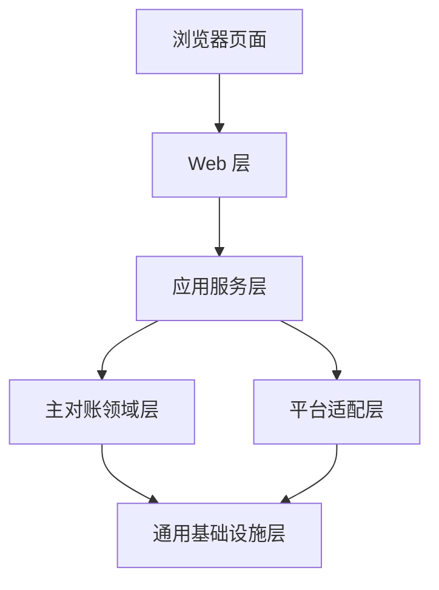

# 项目设计文档

文档版本：v1.1  
整理日期：2026-04-10  
文档用途：明确本地网页对账工具的产品形态、系统架构、技术栈与扩展方案  
当前阶段：项目设计，不包含开发流程

## 1. 项目背景

本项目面向公司财务人员使用，目标用户默认不具备技术背景。

工具的核心目标是：

- 通过本地网页完成对账操作
- 上传 `聚天下` 文件和外部平台文件
- 根据既定业务规则完成对账计算
- 在网页中直接查看结果
- 在网页中查看双向订单差异检查结果
- 支持导出 Excel 结果文件

第一阶段先支持：

- 主平台：`聚天下`
- 外部平台：`携程`

后续预计扩展：

- 飞猪
- 美团
- 其他外部平台

因此本项目不能只做成一次性脚本，而应设计为一个便于扩展和维护的本地系统。

## 2. 设计目标

本项目设计时遵循以下目标：

- 易上手：财务人员打开网页后即可操作，不需要理解技术细节
- 低门槛：第一阶段采用本地服务方式运行，不强依赖复杂部署
- 可扩展：后续新增平台时，可以在不重写整个系统的前提下接入
- 可维护：平台规则、页面逻辑、通用能力分层清晰
- 可核对：结果展示清楚，能让财务快速判断结果是否合理
- 无持久化：第一阶段不保存历史对账记录，不引入数据库

## 3. 范围定义

### 3.1 第一阶段范围

- 本地运行一个网页服务
- 页面中手动选择 `对账月份`
- 页面中选择外部平台
- 上传 `聚天下` Excel 文件
- 上传外部平台 Excel 文件
- 执行对账计算
- 网页中展示结果汇总表
- 网页中展示双向订单差异检查结果
- 导出 Excel 结果文件

### 3.2 暂不纳入范围

- 用户登录
- 权限管理
- 历史记录保存
- 对账结果长期存储
- 多人协作
- 自动定时任务
- 一键打包为桌面程序

## 4. 总体方案选择

## 4.1 选型结论

推荐采用以下方案：

- 后端语言：`Python 3.11+`
- Web 框架：`FastAPI`
- 页面模板：`Jinja2`
- Excel 处理：`pandas + openpyxl`
- 前端交互：原生 `HTML + CSS + JavaScript`
- 运行方式：本机启动服务后，通过浏览器访问本地地址

## 4.2 选择原因

选择该方案的原因如下：

- Python 处理 Excel 和数据汇总最成熟，适合对账类业务
- FastAPI 结构清晰，后续扩展接口和模块都比较自然
- 第一阶段页面需求不复杂，没有必要引入更重的前端工程体系
- 使用浏览器界面对财务更友好，学习成本低
- 未来如果需要打包为桌面程序，也可以在现有本地服务外层继续封装

## 4.3 未采用方案

本阶段不优先采用以下方案：

- `React/Vite` 前后端分离
原因：工程复杂度较高，第一阶段收益不明显

- `Electron/Tauri` 桌面壳
原因：当前不追求一键启动，桌面壳会增加打包和维护成本

## 5. 产品形态设计

系统以“本地网页工具”的形式提供给财务人员使用。

建议使用方式如下：

1. 由内部人员在本机启动服务
2. 财务通过浏览器访问本地地址
3. 在页面中完成上传、计算、查看和导出

页面设计应坚持“单页完成主要流程”的原则，避免页面跳转过多。

## 6. 页面交互设计

首页建议采用一个主页面，包含以下区域。

### 6.1 操作区

页面应提供以下输入项：

- `对账月份`
- `外部平台选择`
- `聚天下文件上传框`
- `外部平台文件上传框`

其中：

- `对账月份` 由财务手动选择
- `外部平台选择` 第一阶段开放 `携程`
- `飞猪`、`美团` 可先作为预留项展示，也可先隐藏，取决于实际交付节奏

### 6.2 按钮区

建议保留两个核心按钮：

- `开始对账`
- `导出 Excel`

说明：

- `导出 Excel` 仅在成功生成结果后可用
- 页面不应提供过多按钮，避免财务误操作

### 6.3 结果区

结果区建议包含三部分：

- 摘要信息
- 主汇总表格
- 订单差异检查区

摘要信息建议展示：

- 对账月份
- 目标平台
- 成功匹配订单数
- 汇总产品数
- 被过滤的非当月平台记录数
- `聚天下有、第三方当月无` 数量
- `第三方有、聚天下当月无` 数量

主汇总表格展示字段：

- 产品名称
- 核销人次
- 销售额
- 结算实付
- 采购金额
- 利润

订单差异检查区建议拆成两个子区域：

1. `聚天下有、第三方当月无`
- 只展示 `订单号`
- 一个唯一订单号占一行

2. `第三方有、聚天下当月无`
- 只展示 `第三方单号`
- 一个唯一订单号占一行

### 6.4 错误提示区

页面需要清晰展示错误或提醒信息，例如：

- 未上传文件
- 文件格式错误
- 缺少关键字段
- 日期无法识别
- 平台文件与所选平台不匹配

错误提示必须让财务能直接看懂，不使用技术术语堆砌。

## 7. 核心业务流程

系统执行一次对账时，建议按以下步骤完成：

1. 财务选择 `对账月份`
2. 财务选择外部平台
3. 上传 `聚天下` 文件
4. 上传外部平台文件
5. 系统校验文件格式和关键字段
6. 系统读取 `聚天下` 数据
7. 系统调用对应平台适配器读取外部平台数据
8. 系统按 `对账月份` 过滤外部平台数据
9. 系统将同一外部订单号下的多条平台流水按订单归集
10. 系统按关联键将两边数据关联
11. 系统基于双方订单号集合生成双向订单差异结果
12. 系统按 `聚天下[产品内容]` 汇总主结果表
13. 系统计算利润
14. 页面展示主结果和差异结果，并提供 Excel 导出

## 8. 按月份筛选设计

由于财务每个月都会做一次对账，因此“月份筛选”必须成为系统的正式能力，而不能写死在代码里。

### 8.1 设计原则

- 对账月份由财务手动选择
- 系统根据所选月份自动生成统计时间范围
- 各平台使用自己的业务日期字段进行过滤
- 不属于所选月份的外部平台记录，不参与本次计算
- 双向订单差异比较也必须建立在“外部平台已完成当月过滤”这一前提上

### 8.2 统一规则

系统应将 `对账月份` 视为统一输入参数，例如：

- 用户选择 `2026-03`
- 系统内部生成统计范围：`2026-03-01` 至 `2026-03-31`

建议系统内部使用“起始日期包含，下一月起始日期不包含”的方式处理，以减少边界问题。

### 8.3 平台日期字段

不同平台可能使用不同的业务日期字段，因此应由平台适配器负责声明和解析。

例如：

- 携程：按 `出发时间` 过滤
- 飞猪：后续由飞猪适配器定义
- 美团：后续由美团适配器定义

主流程不直接关心平台原始字段名，只接收平台适配器输出的标准化日期字段。

在订单差异检查中，也应使用“当月过滤后的外部订单号集合”参与比较，而不是直接拿原始全量平台订单号集合比较。

## 9. 系统架构设计

本项目建议采用分层架构，保证业务规则与平台细节分离。



### 9.1 Web 层

负责：

- 页面展示
- 表单接收
- 文件上传
- 结果返回
- 导出接口

该层不写业务计算规则。

### 9.2 应用服务层

负责：

- 组织一次完整的对账请求
- 调用平台适配器
- 调用主对账逻辑
- 汇总主结果与差异结果并返回页面

它是流程编排层，不承载平台 Excel 解析细节。

### 9.3 领域层

负责：

- 对账核心业务逻辑
- 订单关联
- 双向订单差异识别
- 金额归集
- 按产品汇总
- 利润计算

这一层是系统最核心的业务层，应尽量保持稳定。

### 9.4 平台适配层

负责：

- 识别不同平台的 Excel 结构
- 校验工作表和字段
- 解析平台日期
- 执行平台特有的预处理规则
- 输出统一中间数据结构

后续新增飞猪、美团时，主要改动集中在这一层。

### 9.5 基础设施层

负责：

- 读取 Excel
- 写出 Excel
- 日期解析
- 临时文件处理
- 日志输出

这一层只提供通用能力，不耦合具体平台业务。

## 10. 平台扩展设计

平台扩展应采用“代码接入”的方式，而不是第一阶段就追求完全配置化。

这是符合当前项目阶段的选择，因为：

- 各平台表结构差异较大
- 对账规则可能存在平台特有逻辑
- 代码方式更明确，定位问题更容易

### 10.1 平台适配器模式

建议为每个平台实现独立适配器，例如：

- `CtripAdapter`
- `FliggyAdapter`
- `MeituanAdapter`

每个适配器负责本平台全部解析逻辑，但输出统一结构。

### 10.2 统一适配器职责

每个平台适配器至少应负责：

- 校验文件是否符合本平台格式
- 定位正确工作表
- 提取关键字段
- 解析金额与日期
- 按对账月份过滤
- 按订单粒度归集平台数据
- 为主流程提供可比较的订单号集合基础

### 10.3 平台注册机制

系统应维护一个平台注册表，用于：

- 管理平台标识
- 绑定平台名称和适配器
- 在前端平台下拉框中展示可选项

新增平台时，建议只做以下改动：

1. 新建平台适配器文件
2. 在平台注册表中注册
3. 前端开放该平台选项

## 11. 统一数据结构设计

为了让主对账流程不依赖平台细节，平台数据需要先转换成统一结构。

### 11.1 聚天下标准结构

建议至少包含：

- `order_no`
- `product_name`
- `actual_people`
- `purchase_amount`

### 11.2 外部平台标准结构

建议至少包含：

- `external_order_no`
- `business_date`
- `settlement_amount`
- `platform_name`
- `source_rows_count`

### 11.3 汇总结果结构

建议至少包含：

- `product_name`
- `actual_people_total`
- `sales_amount_total`
- `settlement_paid_total`
- `purchase_amount_total`
- `profit_total`

### 11.4 订单差异结果结构

建议至少包含：

- `internal_only_order_nos`
- `external_only_order_nos`
- `internal_only_count`
- `external_only_count`

其中：

- `internal_only_order_nos` 表示 `聚天下有、第三方当月无`
- `external_only_order_nos` 表示 `第三方有、聚天下当月无`
- 两侧订单号列表都应先去重

这样主对账引擎既能返回主汇总结果，也能返回双向差异结果，而不直接处理原始 Excel 表头。

## 12. 携程平台第一阶段设计

第一阶段携程适配器应围绕当前已确认的业务口径实现。

### 12.1 输入来源

- 文件：`携程.xlsx`
- 工作表：`流水`

### 12.2 关键字段

- `第三方单号`
- `结算价金额`
- `出发时间`

### 12.3 处理规则

- 使用 `出发时间` 按对账月份过滤
- 使用 `第三方单号` 作为与 `聚天下[订单号]` 的关联键
- 同一 `第三方单号` 出现多条流水时，先按订单汇总 `结算价金额`
- 汇总后的订单结果再参与主对账流程
- 在主结果表之外，还要基于“当月过滤后的第三方订单号集合”输出双向订单差异结果

## 13. 输出设计

系统应支持两种输出方式：

- 页面直接查看
- 导出 Excel

### 13.1 页面输出

页面输出用于快速核对，适合财务直接查看。

表现形式建议为清晰的表格，不需要复杂图表。  
金额列建议统一保留两位小数。

### 13.2 Excel 导出

导出文件用于留档、继续加工或对外发送。

建议导出内容至少包含：

- 对账月份
- 平台名称
- 主汇总结果表
- 订单差异检查结果

订单差异检查结果建议按两个独立区域或两个独立工作表导出：

- `聚天下有、第三方当月无`
- `第三方有、聚天下当月无`

建议导出文件名包含：

- 平台名称
- 对账月份
- 导出时间

示例：

- `对账结果_携程_2026-03_20260409_153000.xlsx`

## 14. 错误处理设计

由于本项目面向财务使用，错误处理不能只面向开发人员，而应面向业务使用者。

### 14.1 错误类型

建议分为以下几类：

- 输入错误
- 文件结构错误
- 数据格式错误
- 业务提示信息

### 14.2 错误提示原则

- 提示要明确指出问题是什么
- 提示要尽量指出用户应该如何处理
- 不直接暴露难懂的技术异常栈

示例：

- `请先选择对账月份`
- `请上传聚天下文件`
- `携程文件缺少“第三方单号”列，请检查是否上传了正确的流水表`
- `携程文件中的“出发时间”存在无法识别的日期，请检查原始数据格式`

## 15. 非功能设计

### 15.1 易用性

- 页面操作步骤尽量少
- 关键输入项集中在首页
- 错误信息可直接指导财务处理

### 15.2 可维护性

- 平台逻辑独立
- 核心业务逻辑统一
- 通用能力下沉到基础设施层
- 主汇总结果与差异结果的结构边界清晰

### 15.3 可扩展性

- 新平台通过新增适配器接入
- 前端流程保持稳定
- 核心汇总逻辑尽量复用

### 15.4 数据安全

- 第一阶段不做持久化
- 上传文件仅用于当次处理
- 处理完成后不保留历史数据

## 16. 建议目录结构

```text
finance/
  app/
    main.py
    web/
      routes.py
      templates/
      static/
    application/
      reconciliation_service.py
    domain/
      reconcile.py
      summarizer.py
      calculators.py
    platforms/
      base.py
      registry.py
      ctrip_adapter.py
      fliggy_adapter.py
      meituan_adapter.py
    infrastructure/
      excel_reader.py
      excel_writer.py
      date_parser.py
      temp_files.py
    models/
      dto.py
      result.py
  test_data/
  reconciliation_requirements_draft.md
  项目设计文档.md
```

## 17. 设计结论

本项目建议做成“本地服务 + 浏览器页面”的对账工具。

第一阶段聚焦于：

- 支持财务通过网页完成对账
- 支持 `聚天下 + 携程` 对账
- 支持手动选择 `对账月份`
- 支持网页查看主结果和双向订单差异结果
- 支持 Excel 导出
- 不做持久化

系统在架构上采用“统一主流程 + 平台适配器”模式。

这一方案兼顾了三件事：

- 财务使用简单
- 当前开发复杂度可控
- 后续扩展飞猪、美团时不需要推翻整体架构
